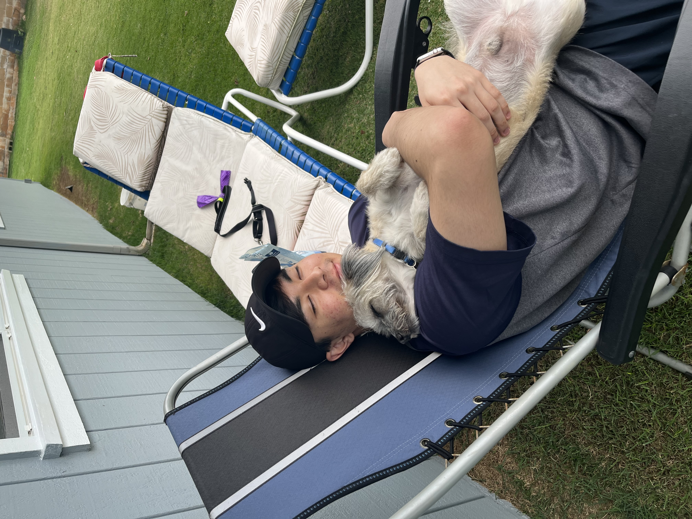

```{r setup, include=FALSE}
knitr::opts_chunk$set(echo = TRUE, fog.align = 'center', fig.width = '40%')
```

## A little bit about me.

My name is Micah Matsunaga. I'm a fourth year OTM student in the Pamplin School of Business here at the University of Portland. I graduated high school in 2019 from Kauai High School on the island of Kauai in Hawai’i. Before you ask, no, I don’t know how to surf but I wish I had learned while I was younger (I have back problems now I’m getting too old). In my free time, I enjoy playing sports and a couple of the sports that I am still currently playing are Badminton, Pickleball, and Tennis. I also enjoy playing video games, some of which include titles that I would prefer not to mention in fear of public shame. I enrolled in this class because I enjoyed coding in a couple of other classes I took previously so I figured I would have some fun and learn something useful to my career path as well.


Me and my dog 

# TEEBI


A pic of my friend's cat who is the **best** and *cutest* cat in the <span style="text-decoration:underline">**entire world**</span> 

## Some of My Favorite Music Artists and My Favorite Song(s) By Them
Artist | Song
-------|-----
grentperez | Conversations with the Moon <br> My Heart It Beats For You <br>
Rex Orange County | Amazing <br> Never Enough <br>
Tyler, The Creator | WUSYANAME <br> I THINK <br>
Gen Hoshino | Koi
JANNABI | For Lovers Who Hesitate <br> ASTEARSGOBY <br>
IU | Friday
Sumika | Fiction
NIKI | Newsflash! <br> Keeping Tabs <br> 
Queen | Good Old-Fashioned Loverboy


#### Final Thoughts

Finally, this is a video that means a lot to me as a person and in a way, shaped me to become the person I am today.
[YouTube Video](https://youtu.be/dQw4w9WgXcQ)